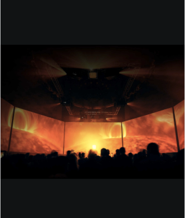

# Mix Blend Mode

The `mix-blend-mode` CSS property describes how an element should blend with the content of the element's parent and the element's background.

Example:

Without `mix-blend-mode`:

With `mix-blend-mode: screen`:

If you want to remove the `mix-blend-mode` effect on an element, you can use `mix-blend-mode: unset`.

Other properties can be found [here](https://developer.mozilla.org/en-US/docs/Web/CSS/mix-blend-mode)
