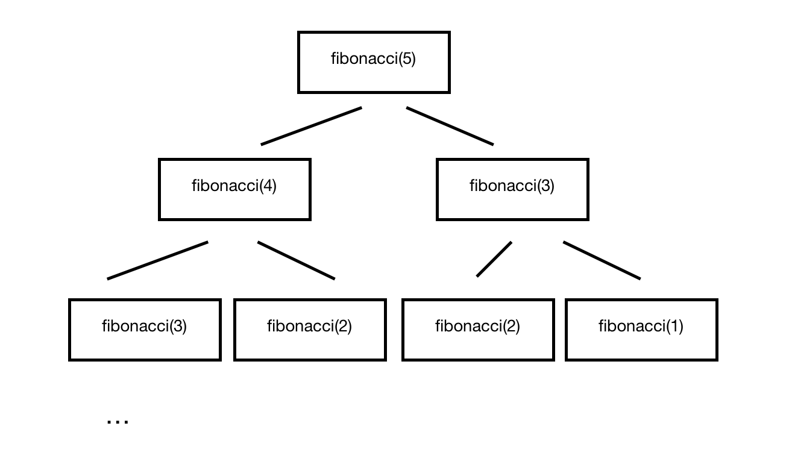

# Memoization

Memoization is an optimization technique to compute programs so that some calculations don't happen multiple times by keeping a record of the results for the given inputs.

Example with the Fibonacci sequence. The Fibonacci numbers are organised so that a certain number is the sum of the 2 previous numbers in the sequence. The sequence always starts with 1,1.
So the first 10 numbers in the sequence are 1,1,2,3,5,8,13,21,34,55.

### Recursively

The nth Fibonacci number can be computer recursively like this:

```javascript
function fibonacci(n){
  if(n === 0 || n === 1){
    return 1;
  } else {
    return fibonacci(n-1) + fibonacci(n-2);
  }
}
```

(Big-O notation of this function is O(2^n) because it grows exponentially)

This function works but if `n` is a big number, there will be a hit in performance.
The 2 recursive calls repeat the same operation.

In the case of calling `fibonacci(5)`, the following calls will be made:



I got a bit lazy so they're not all there but the point is that some calculations will be made multiple times when it is not needed.


### Memoization

Memoization allows to catch previously calculated results to improve performance.

If we want to find the nth number in the sequence, it would look like this:

```javascript
function fibonacci(){
  var memo = {}

  function f(n){ //index
    var value;
    if(n in memo){
      value = memo[n];
    } else {
      if(n === 0 || n === 1){
        value = 1
      } else {
        value = f(n-1) + f(n-2)
      }
      memo[n] = value
    }
    return value;
  }
  return f
}
```

(The Big-O notation of this function is O(n))

