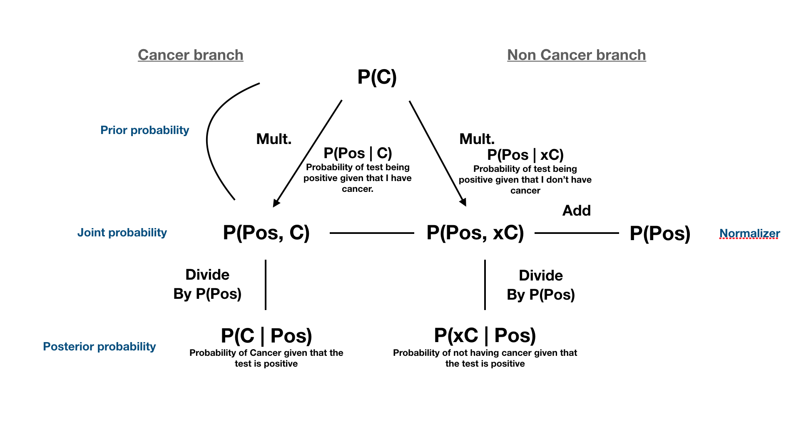
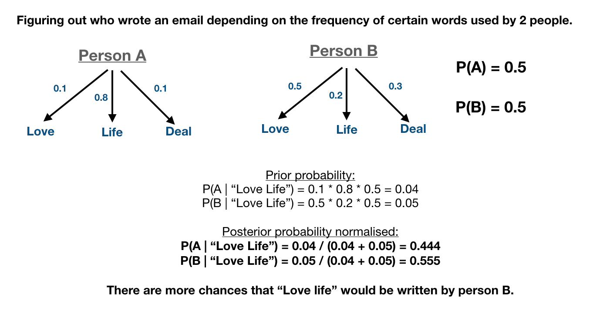

# Bayes rule – algorithm

Calculating probability:

Cancer example:

* P(C) – probability of having cancer – prior.
* P(Pos | C) – probability that the test is positive <u>given</u> that I have cancer – sensitivity.
* P(Neg | xC) – probability of the test being negative <u>given</u> that I don't have cancer – specificity.

Probability of test positive:

Other example:

