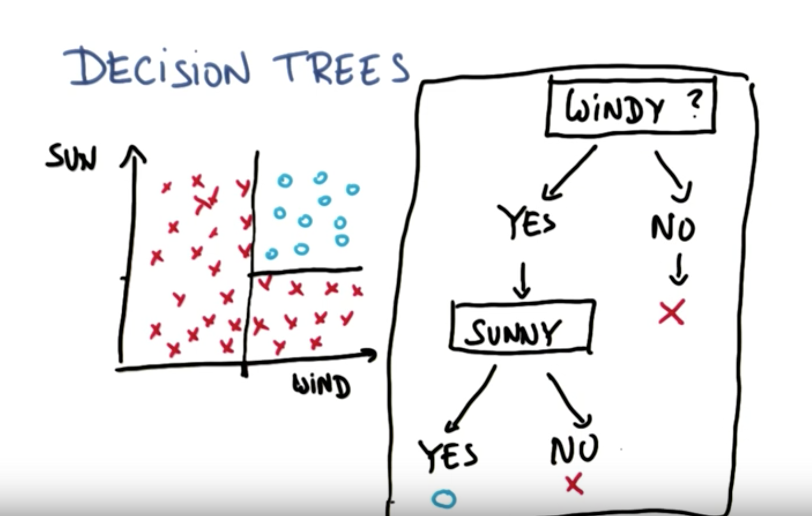

# Decision Tree

Another very famous **classifier algorithm is the decision tree**.



```python
clf = tree.DecisionTreeClassifier(min_samples_split=2)
clf.fit(features_train, labels_train)
pred = clf.predict(features_test)
acc_min_samples_split_2 = accuracy_score(pred, labels_test)
print acc_min_samples_split_2
```

The higher the samples split, the higher the accuracy.

* Entropy: controls how the Decision Tree decides where to split the data.
