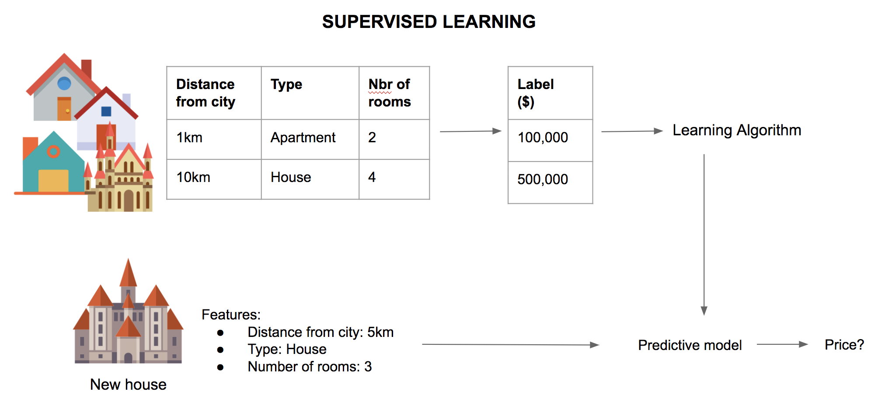
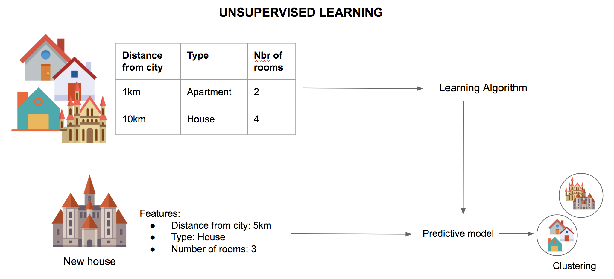

# Supervised vs. Unsupervised learning

3 basic types of machine learning algorithms:

**supervised**, **unsupervised** and **reinforcement** learning.

Example: Predicting the price of a house.

## Supervised

Supervised learning works with a dataset made of **features** and **labels**.
If we take a dataset of different houses which features are:

* Distance from the city
* Type of house
* Number of rooms

And labels are the price of each house.

We start by **fitting** the **classifier** with these features and labels to create a **predictive model**.
Once this model is trained, we can use a new input (new house), run the predictive model with it and get a prediction of a price for that new house. 

## Unsupervised

Unsupervised learning works a little differently as instead of predicting a particular price, we are trying to **identify patterns**.

If we take the same dataset as before, the only difference is that we do not use labels to train the predictive model. As no label is provided, the output will be **clusters** of house that have similar features so we can get an indication of how much a new house is going to be based on similar house. 