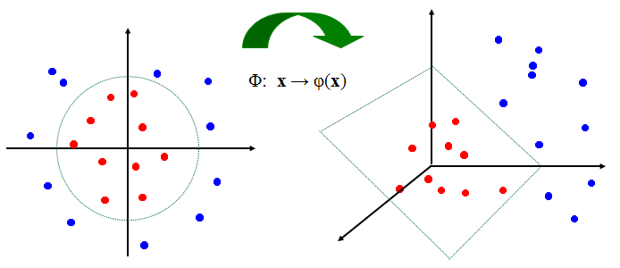

# SVM (Support Vector Machine)

Another supervised learning algorithm is **SVM**, Support Vector Machines. It is very similar to Naive Bayes in the sense that it allows a **linear classification** between two sets of data.

A SVM model is a representation of the data as **points in space**, mapped so the examples of two categories are divided by a clear gap maximised between the categories.
New examples are then mapped into the same space and predicted to belong to a category based on which side of the gap they appear.


To separate the data into 2 distinct spaces, we want to try and find a dimensional hyperplane. This is called a **linear classifier**. The ideal hyperplane is the one that represents the largest separation between the two classes. We choose the hyperplane so that the distance from it to the nearest point of each class is maximised. If it is found, it is called **maximum-margin hyperplane** and the linear classifier is known as **maximum-margin classifier** or perceptron of optimal stability.

Besides no representing the classification in a linear way (with a straight line between the two categories), SVM can also perform a **non-linear classification** using what is called the **kernel**, mapping data into a high-dimensional space.



Example from Udacity's Machine Learning course:

```python
#!/usr/bin/python

"""
    SVM to identify emails by their authors:
    Sara has label 0
    Chris has label 1
"""

import sys
from time import time
sys.path.append("../tools/")
from email_preprocess import preprocess
from sklearn import svm
import numpy as np
from sklearn.metrics import accuracy_score


### features_train and features_test are the features for the training
### and testing datasets, respectively
### labels_train and labels_test are the corresponding item labels
features_train, features_test, labels_train, labels_test = preprocess()

# the accuracy is still very good using only parts of the training sets and it allows the program to run much faster.

# features_train = features_train[:len(features_train)/100]
# labels_train = labels_train[:len(labels_train)/100]

clf = svm.SVC(kernel='rbf', C=10000) #Initiates a non-linear Support Vector Machine Classifier. To make it linear, change the kernel argument to 'linear'.

t0 = time()
clf.fit(features_train, labels_train) #train the classifier.
print "training time:", round(time() - t0, 3), "s"

t0 = time()
pred = clf.predict(features_test)
print "prediction time: ", round(time()-t0, 3), "s"
acc = accuracy_score(pred, labels_test) #Checking accuracy of prediction.

num_Chris = 0;

for prediction in pred:
    if prediction == 1:
        num_Chris += 1

print "Number of predictions for Chris", num_Chris
print acc

```

## SVM parameters:

C, gamma and Kernel.

* Gamma: defines how far the influence of a single training example reaches.

  * Low value – even the points far away in each data set are taken into consideration to determine the decision boundary.
  * High value – only the points closer are taken into consideration.

Low value of gamma gives a more linear separation because even the points far away from it influence the decision boundary.

## Overfitting

When the data is taken too literally and the decision boundary is too specific when it could be simplified.
Overfitting should be avoided.
