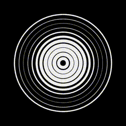
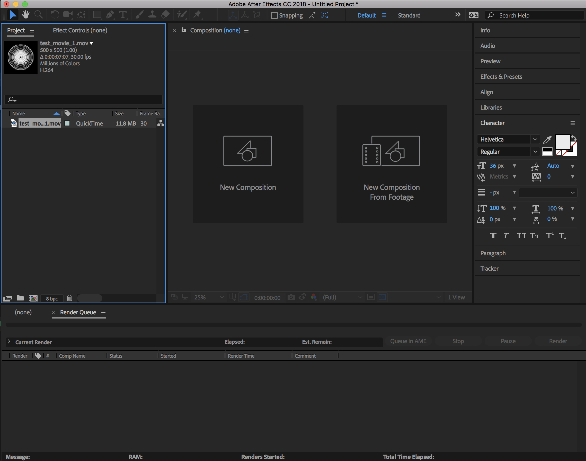
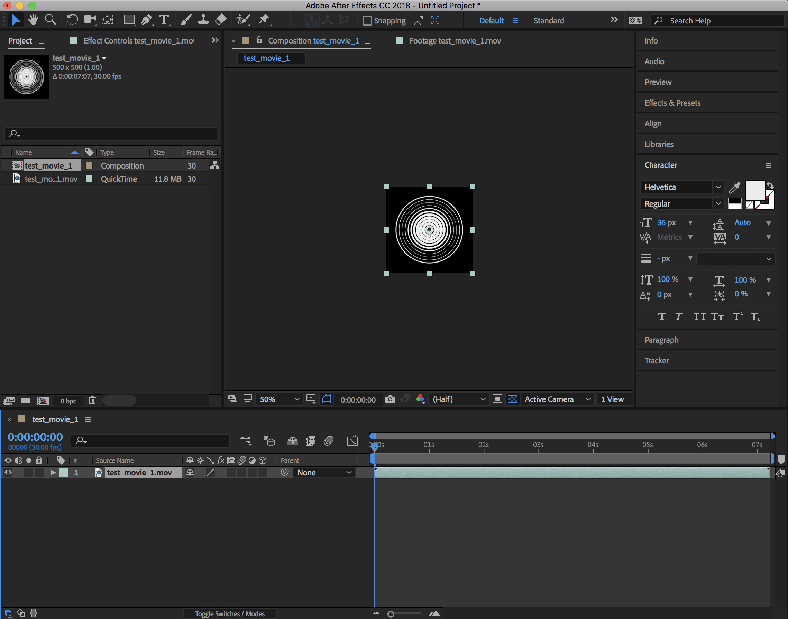
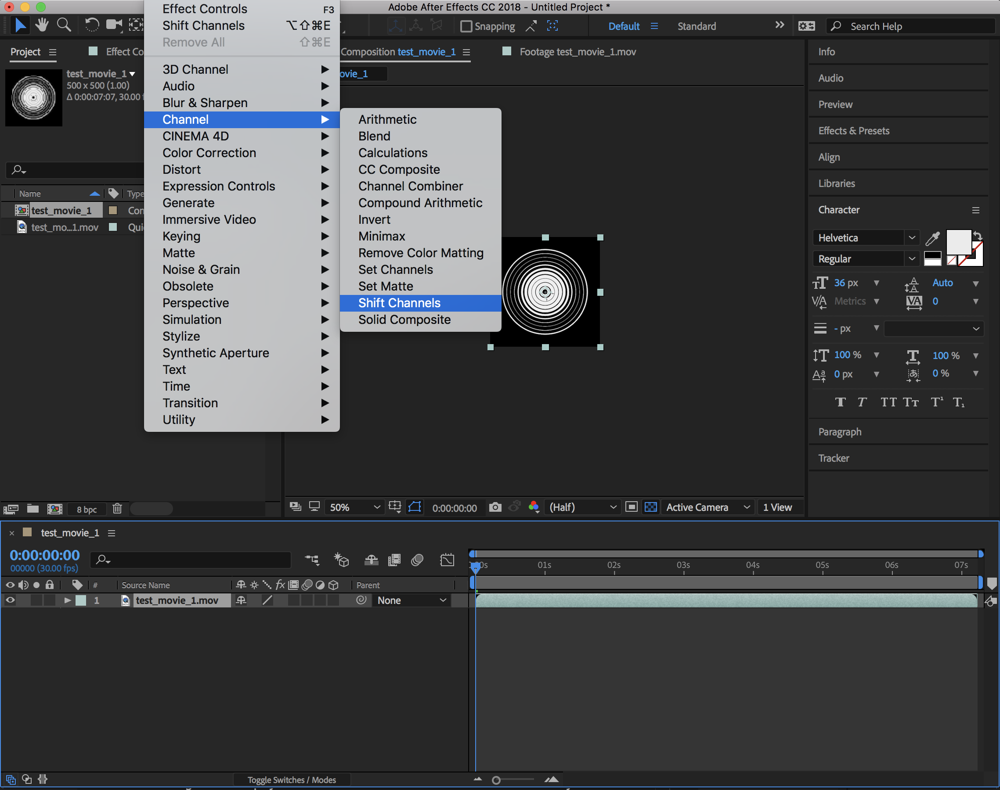
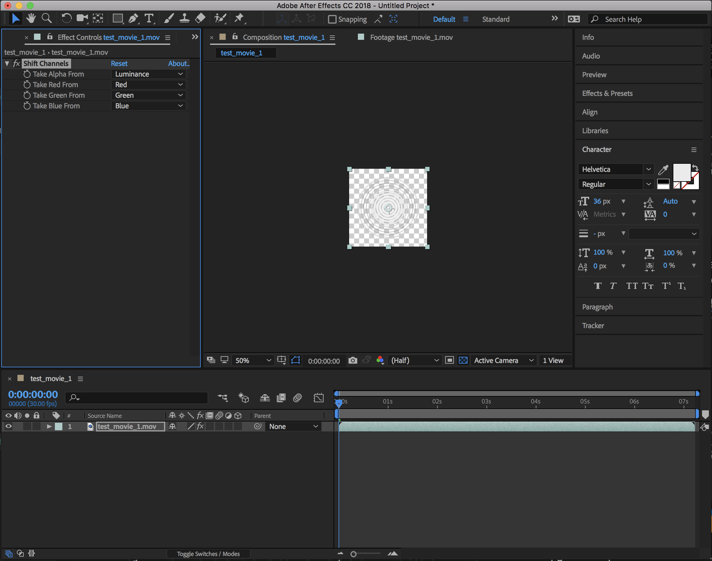
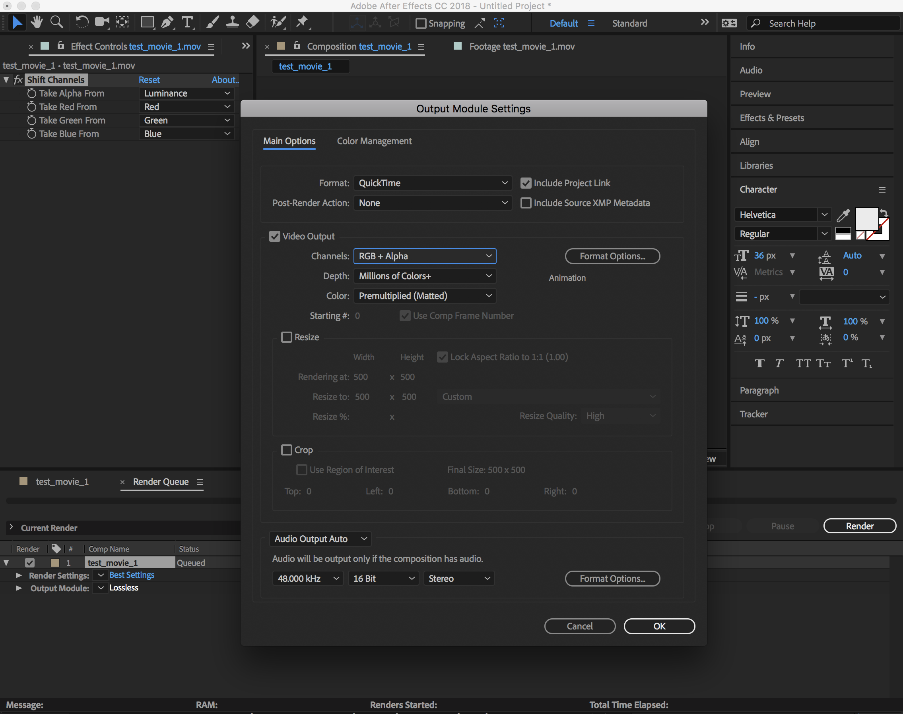
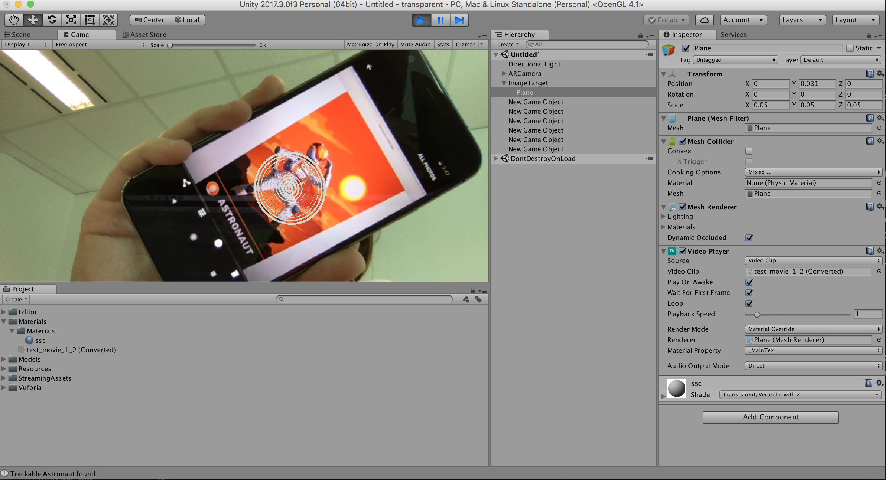

# How to save a video with transparent background and use it in AR in Unity

I've been wanting to do some ARt (Augmented Reality Art) for a while now and struggled with creating animations with transparent background to create AR posters. I've finally figured it out so here's the solution!

First, I create an animation with code using Processing. For example, something like this:

I saved the animation as a video and then, I wanted to be able to remove the black background to have a transparent video.

To do so, I used Adobe After Effects.

## Save the video with transparent background

* Open After Effects.
* File > Import > File and select your video.

* Close the `Render Queue` tab if open and drag the video to the bottom left window.

* Effect > Channel > Shift channels, then in the `Take Alpha from`, select `Luminance`.
This should remove the black background.

* Composition > Add to render queue.
* At the bottom, clik on the option saying `lossless`. The output module settings window should open.
* Change video output channels to be `RGB + Alpha`.
* Click the `format option` button and check that the format is `Animation`.

* Click ok and `render` on the right.

It should export your animation with transparent background.

* Go to where the video has been exported and open it with Quicktime. It should do some kind of conversion and save that converted version (this is the one we'll use in Unity).

Now go to Unity.

## Using the video in Unity.

* Open Unity, log in and create a new project.
* Delete the Main Camera.
* Add a Vuforia AR camera.
* In the project tab (bottom left), create a new folder and call it `Materials`.
* Add a Vuforia image target.
* Inside that Image target, create a plane game object.
* Drag and drop your video inside the materials folder you created.
* Click on it and make sure to select `Keep alpha` and `transcode` and `apply`.
* For some reason, for the transparency to work, try and also drag an image in the materials folder and then drag it on the plane.
* When you drop an image, a new Materials folder should be created with an actual material inside.
* If you click back on your plane object, you should see at the bottom a `shader` option. Instead of standard, select transparent.
* Drag your video on the plane and delete the image in the materials folder.
* If you click on your plane object in the hierarchy window, you should see a `Video Player` section.
* Click on the play button to try it with your webcam and you should see your animation on your image target with a transparent background! :D

