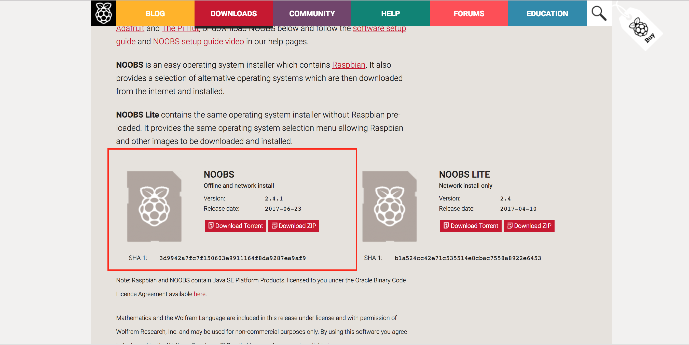
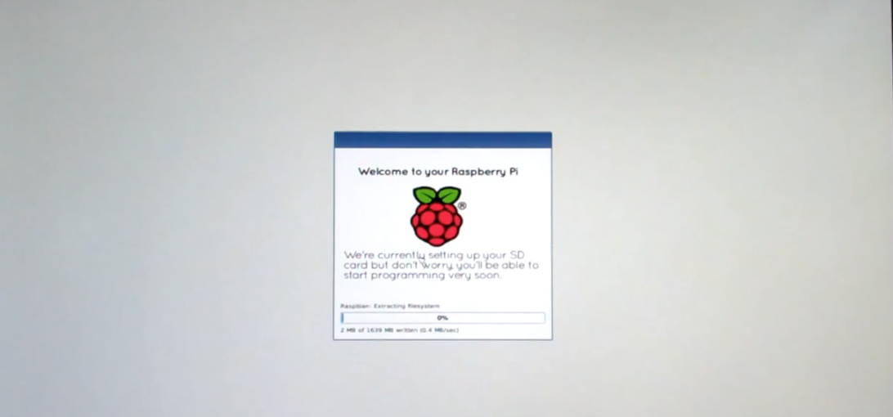

# Basic Setup

#### Material needed:

* Raspberry Pi
* USB keyboard
* USB mouse
* Ethernet cable (if RaspPi doesn’t have integrated wifi)
* Micro usb charger
* Wifi dongle
* HDMI cable


#### Steps:

Go to this site: https://www.raspberrypi.org/downloads/noobs/ and download the following version of NOOBS.




While it downloads, insert your SD card into your computer and go to this site to download the formatter.
https://www.sdcard.org/downloads/formatter_4/eula_mac/index.html

Once it is downloaded and installed, launch the program and format the SD card. It can take a bit of time depending if the card already contained files or not.

Once your SD card is formatted and NOOBS is downloaded, check that your SD card is empty and copy all the files from NOOBS onto the SD card.

Once this is done, you can start booting your RPi.
Connect the keyboard and mouse to the RPi, connect the board to a monitor using the HDMI port and power the RPi via the micro USB port.

Once you turn it on, you should see something like this on your monitor:



Now just wait for it to finish booting. It can take a while…

Once the RaspPi is booted, you will see the graphical interface.
Open the Terminal and write `startx`

If the raspberry pi is asking for a password at any time, the default password for Raspbian is “raspberry”.

#### Boot to terminal rather than desktop environment

By default, the RPi will boot to desktop environment (graphical interface). For some programs, you'll get errors like the following:

```
server is already running for display 0
```

To fix this, you can run `sudo raspi-config` in the terminal and follow the following steps:

* Select 3 - Boot Options
* Select B1 - Desktop / CLI
* Select B2 - Console Autologin

and reboot.

If there are still errors, maybe run `sudo apt-get install xserver-xorg-legacy`.
